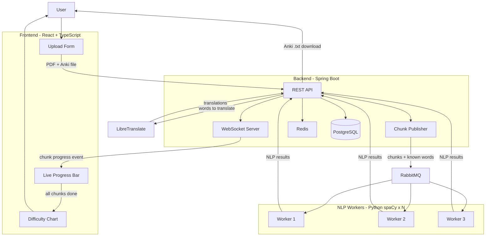

# French Book Difficulty Analyzer

A distributed system that analyzes the linguistic difficulty of French texts and generates personalized Anki flashcard decks based on your existing vocabulary.

---

## Overview

Upload any French PDF and the system breaks it into chunks, processes them in parallel across multiple NLP workers, and returns a difficulty curve showing which parts of the book will challenge you most.

Optionally upload your existing Anki deck to filter out words you already know — the difficulty score then reflects only **your personal vocabulary gaps**, not the book's overall complexity.

When the analysis is complete, export the results directly as an Anki-compatible `.txt` file with French words, English translations (via self-hosted LibreTranslate), and example sentences pulled straight from the original text.

---

## Architecture



**Data flow:**
1. User uploads a French PDF (+ optional Anki `.txt` export)
2. Spring Boot parses the PDF into chunks and publishes them to RabbitMQ
3. Multiple Python workers consume chunks in parallel, running spaCy NLP analysis
4. Workers POST results back to Spring Boot, which saves them to PostgreSQL
5. Frontend receives a WebSocket event per completed chunk showing live progress
6. Once all chunks are done, the difficulty chart renders from the full results
7. On export, Spring Boot fetches all top words and translates them via LibreTranslate

---

## Tech Stack

| Layer | Technology |
|---|---|
| Frontend | React, TypeScript, Vite, Recharts |
| Backend | Spring Boot 3, Java 21 |
| NLP Workers | Python, spaCy (fr_core_news_md) |
| Message Queue | RabbitMQ |
| Database | PostgreSQL 16 |
| Cache / State | Redis 7 |
| Translation | LibreTranslate (self-hosted) |
| Real-time | WebSocket (STOMP) |
| Infrastructure | Docker, Docker Compose |

---

## Getting Started

### Prerequisites

- Docker and Docker Compose installed
- ~2GB free disk space (for LibreTranslate language models)

### Installation

**1. Clone the repository**
```bash
git clone https://github.com/yourusername/french-analyzer.git
cd french-analyzer
```

**2. Configure environment variables**
```bash
cp .env.example .env
```

Key variables you may want to adjust:
```env
WORKER_REPLICAS=3        # Number of parallel NLP workers
TOP_WORDS_LIMIT=25       # Difficult words tracked per chunk
VITE_API_URL=http://localhost:8080
```

**3. Start all services**
```bash
docker compose up
```

> **Note:** On first run, LibreTranslate downloads French→English language models (~500MB). This takes 2-3 minutes. Subsequent starts are instant thanks to Docker volume caching.

**4. Open the app**
```
http://localhost:5173
```

### Usage

1. Upload a French PDF (up to 50MB)
2. Optionally upload an Anki `.txt` export to personalize your difficulty score
3. Watch live progress as each chunk is processed via WebSocket updates
4. Once complete, the difficulty chart renders automatically
5. Click **Export to Anki** to download your personalized flashcard deck

---

## Project Structure

```
french-analyzer/
├── frontend/          # React + TypeScript app
├── demo/              # Spring Boot backend
├── workers/           # Python spaCy NLP workers
├── docker-compose.yml
└── .env
```

---

## Design Decisions

**Why RabbitMQ over direct HTTP?** Decouples chunk production from processing. Workers scale independently and unacknowledged messages stay in the queue until successfully processed — no work is lost if a worker crashes mid-chunk.

**Why WebSockets over polling?** Gives instant feedback as each chunk completes rather than waiting for the full analysis, which can take 30+ seconds for long books.

**Why self-hosted LibreTranslate?** Keeps the stack fully offline-capable with no external API keys or rate limits required.

**Why pass known words through RabbitMQ messages instead of Redis?** Avoids an extra network call per chunk inside each worker. The known words set is small enough to serialize directly into the message payload.

---

## Future Improvements

- Redis caching for duplicate chunk deduplication
- Support for `.epub` format
- User authentication and saved analysis history
- Kubernetes deployment for production scaling